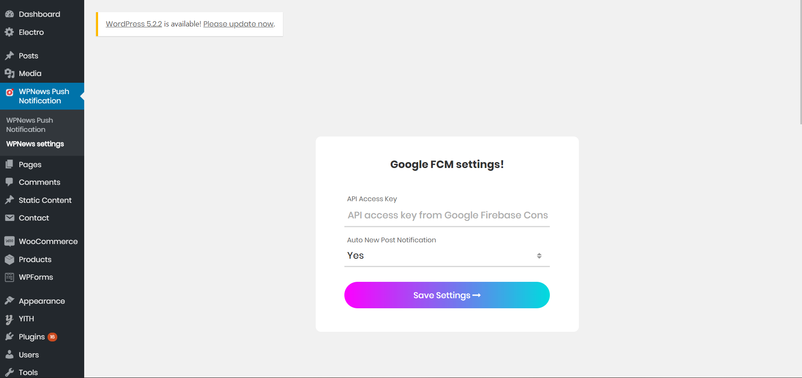
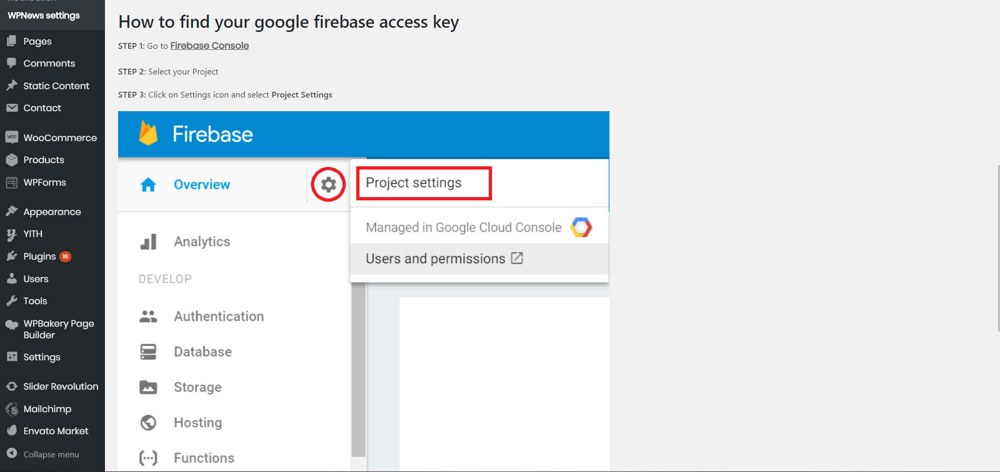
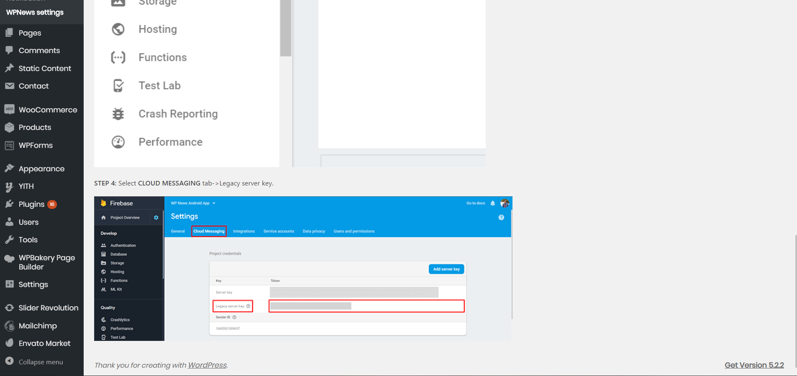

# wp-news-notification
Wordpress Plugin for Automated and custom push notification to android device by using FCM.

# Usage :
1. Download wp-news-notification
2. Upload Plugin zip to your workpress site and Activate Plugin.
3. Folow Instruction given in plugin setting page to get your FCM API.
thats all.

# Screenshots :
1. Custom Notification Form.

2. Plugin Settings.

3. Plugin Settings - FCM Help 1.

4. Plugin Settings - FCM Help 2.

